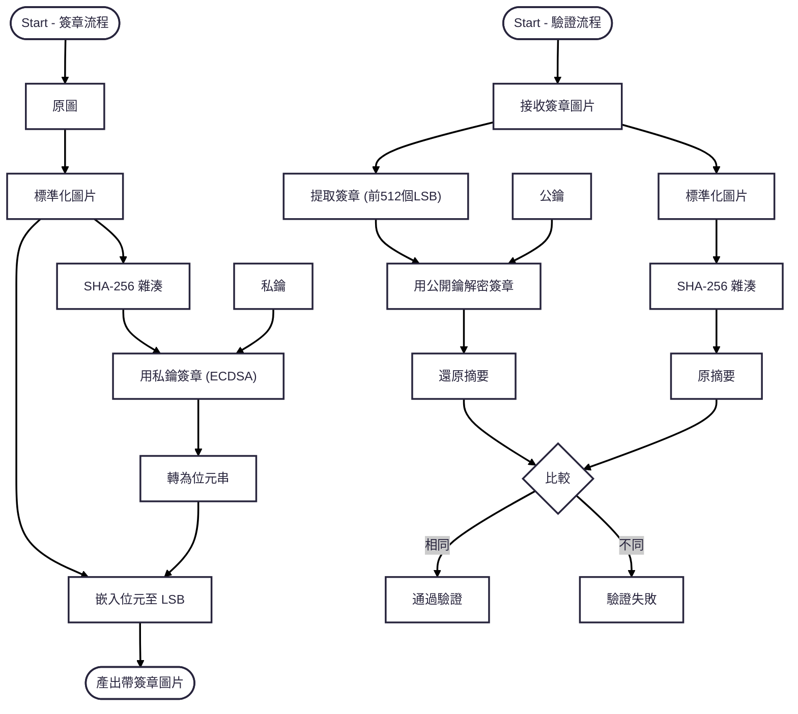

# PixelSign

## 概念簡介

PixelSign 是一套基於數位簽章和機器歷史驗證技術的圖像防假驗證系統，本計畫目的是為了區分人類創作和AI生成內容，防止未經證明的情況混淆。

本技術核心是：
- 使用數位簽章+hash技術，確認圖像本身未被修改
- 將簽章資料隱藏於傳統圖像最低有效位 (LSB)
- 任何輕微修改都會破壞此簽章，屬於高清準感測性証明

---

## Feature

- **數位签簽技術**: ECC P-256 書簽，保護圖像不可偵改
- **完全隱形的位元签簽**: 签簽隱藏於圖像最小的bit，不影響人眼視覺
- **難以仿製，任何修改都破壞驗證**
- **區分簽章與證明內容，容易擴張成多重簽章模型**

---

## 技術細節 (Workflow)

---

## 未來擴張
- 支援同時封裝多組簽章（多第三方同時認證）
- 支援多餘資訊遷入和個信多餘資訊遷入和個性浮水印
- 支援前季的後量字元符簽署模型（抗量字電腦的签簽技術）
- 支援變成因常抽點驗證（適對繁複圖形或大型圖像）
- 支援在圖片大小允許的前提下塞些作品資料

---

## License

This project is released under the MIT License.